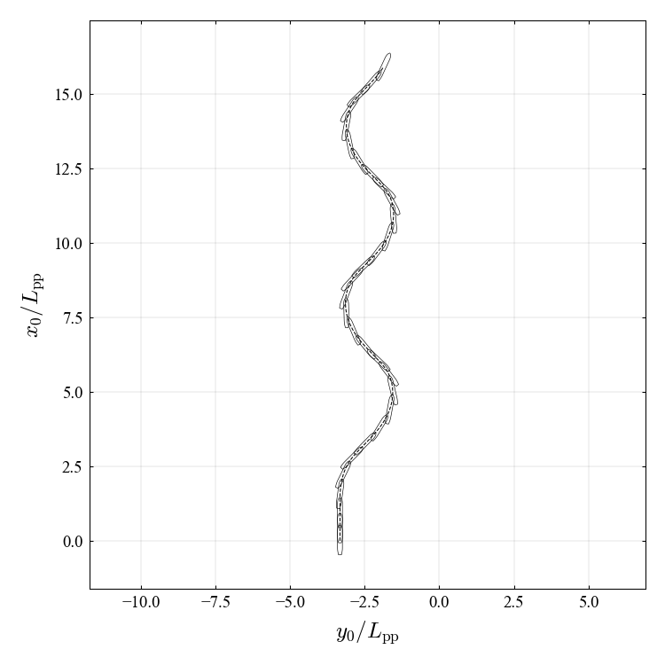
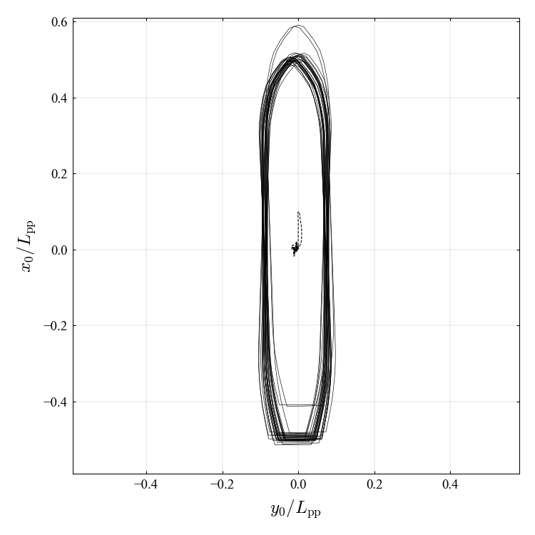
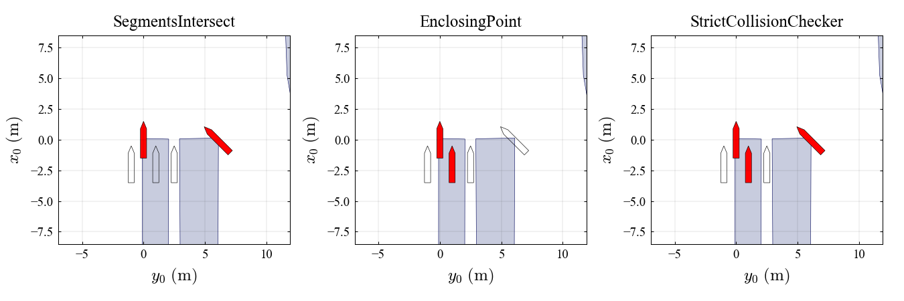

# py-ship-simulator

`py-ship-simulator`は船舶操縦シミュレーション Python ライブラリです．このライブラリの主な目的は以下の通りです．

- MMG モデルベースの操縦シミュレーションをより容易にすること
- 個人的なバグを最小限にすること

## Usage

### Installation

ソースコードをダウンロードした後，`pyshipsim`フォルダを作業ディレクトリに配置してください．
もしくは pip でインストールしてください．（非推奨）

```bash
pip install git+ssh://git@github.com:NAOE-5thLab/py-ship-simulator.git
```

### Compilimg `.f90` files

本シミュレータは Python のみで機能するが，一部の MMG モデルが Fortran で実装されており，高速化が可能である．しかし，F2py の仕様上 `.f90` ファイルのコンパイルをあらかじめ行っておく必要があります．コンパイル方法は以下の通りです．

<details>
<summary>Esso Osaka (3m)</summary>

```bash
cd pyshipsim/ship/maneuver/mmg/esso_osaka_3m/f2py
gfortran -c mmg_esso_osaka_verctor_input.f90
f2py --fcompiler=gnu95 -m f2py_mmg_esso_osaka_3m -c --f90flags='-O3' mmg_esso_osaka_verctor_input.f90
cd ../../../..
```

windows なら` --compiler=mingw32`

</details>

<details>
<summary>Esso Osaka (150m)</summary>

```bash
cd pyshipsim/ship/mmg_esso_osaka_150m/f2py_mmg
gfortran -c mmg_esso_osaka_realscale.f90
f2py --fcompiler=gnu95 -m f2py_mmg_esso_osaka_150m -c --f90flags='-O3' mmg_esso_osaka_realscale.f90
cd ../../../..
```

</details>

<details>
<summary>Takaoki</summary>

```bash
cd pyshipsim/ship/mmg_takaoki_3m/f2py_mmg
gfortran -c mmg_takaoki_VR_verctor_input.f90
f2py --fcompiler=gnu95 -m f2py_mmg_takaoki_3m -c --f90flags='-O3' mmg_takaoki_VR_verctor_input.f90
cd ../../../..
```

</details>

### Tutorial

チュートリアルノードブックを用意しました．必要に応じて参照してください．

- [tutorial_esso_osaka.ipynb](tutorial_esso_osaka.ipynb) : Esso osaka のシミュレーション (旋回，Z)
- [tutorial_takaoki.ipynb](tutorial_takaoki.ipynb) : Takaoki のシミュレーション (旋回，DP)
- [tutorial_create_model.ipynb](tutorial_create_model.ipynb) : 新たな Ship モデルの実装 (KT モデル)
- [tutorial_collision.ipynb](tutorial_collision.ipynb) : 衝突判定モジュール
- [tutorial_wind_process.ipynb](tutorial_wind_process.ipynb) : 風の確率過程モジュール

## Demo

##### Zigzag test of EssoOsaka (Done by [tutorial_esso_osaka.ipynb](tutorial_esso_osaka.ipynb))



##### Positioning test of Takaoki (Done by [tutorial_takaoki.ipynb](tutorial_takaoki.ipynb))



##### Collision detection test in Inukai pond (Done by [tutorial_collision.ipynb](tutorial_collision.ipynb))



## Update history

| Version              | Descriptions                                                                                                      |
| -------------------- | ----------------------------------------------------------------------------------------------------------------- |
| v0.1 (2023/Jul/27)   | 簡易的にシミュレータを作成した．                                                                                  |
| v1.0.0 (2023/Aug/2)  | アクチュエータと船体で状態変数の数値積分方法が異なっていた構造問題を解決した． <br />複数の船種と港湾を追加した． |
| v1.1.0 (2023/Sep/4)  | Ship と World の切り分け方法を整理し直した．                                                                      |
| v1.1.1 (2023/Sep/9)  | バグ修正（#6,#8,#9）                                                                                              |
| v1.2.0 (2023/Dec/18) | F2py ファイルの配置変更，バグ修正                                                                                 |
| v1.2.1 (2023/Dec/18) | PCC モデル統合                                                                                                    |
| v1.3.0 (2024/Jul/??) | モジュール名変更，ファイルの配置変更，衝突判定モジュールの見直し．                                                |
